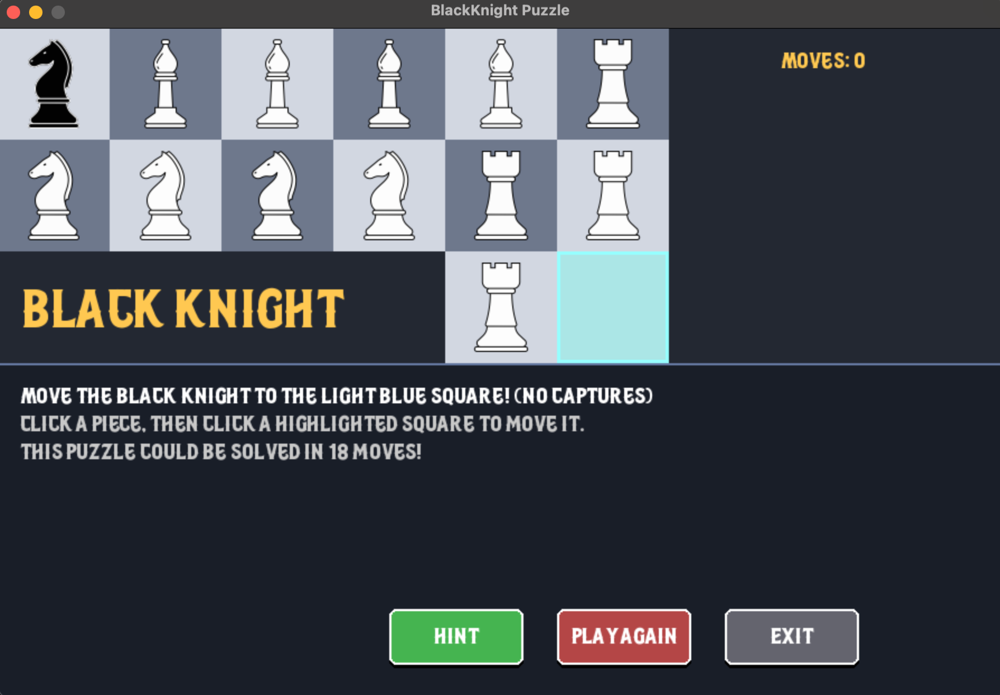
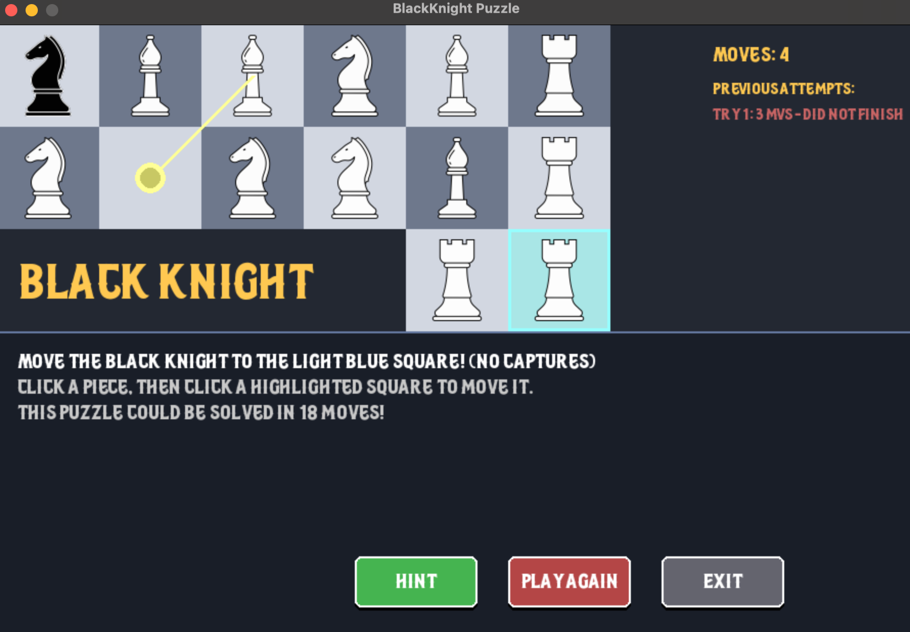

# Black Knight Chess Puzzle Game

A challenging Pygame-based chess puzzle game where your objective is to maneuver the black knight to a target square while navigating around white pieces. This is a single-player puzzle game that tests your strategic thinking and planning skills.

## Overview

In this puzzle game, you control a lone black knight surrounded by white chess pieces (bishops, rooks, and knights). Your goal is to move the black knight to the target square (the light blue square) in the minimum number of moves. The twist: pieces can only move into the empty square on the board, creating a sliding puzzle-like mechanic combined with chess piece movement rules.

## Features

- Interactive Chess Puzzle Gameplay: Move pieces strategically to create a path for the black knight
- Smooth Animations: Pieces animate smoothly when moving across the board
- Hint System: Get AI-powered hints using breadth-first search to find the optimal next move
- Move Counter: Track how many moves it takes to complete the puzzle
- Visual Feedback: Hover effects, pulsing valid move indicators, and glowing target square
- Win Screen: Celebratory message displaying your final move count
- PyInstaller Compatible: Includes resource path handling for bundled executables

## Screenshot



## How to Play

1. Select a Piece: Click on any white or black piece to select it
2. View Valid Moves: When a piece is selected, all valid moves appear as pulsing blue circles
3. Move a Piece: Click on a highlighted blue circle to move the selected piece to that square
4. Reach the Target: Move the black knight to the light blue square in the bottom-right area of the board
5. Use Hints: Click the "Hint" button to receive an AI suggestion for your next move
6. Play Again: Click "Play Again" to reset the puzzle and try again

## Game Rules

- Pieces Move According to Chess Rules: Knights move in an L-shape (2 squares in one direction, 1 square perpendicular), Bishops move diagonally any number of squares, Rooks move horizontally or vertically any number of squares
- Only Move into Empty Squares: Pieces can only move to the currently empty square on the board
- No Captures: This is a puzzle game—pieces cannot capture each other
- Objective: Get the black knight to square (5, 2)—the glowing target in the lower right

## Controls

- Mouse Click: Select pieces and move them
- Hint Button: Get an AI-suggested move using optimal pathfinding
- Play Again Button: Reset the puzzle to its starting position

## Technical Details

### Requirements

Python 3.7+ and Pygame

### Installation

```bash
pip install pygame
```

### Running the Game

```bash
python blackknight.py
```

### Project Structure

The game expects the following directory structure for assets:

```
project_root/
├── build/web/assets/
│   ├── images/
│   │   ├── black knight.png
│   │   ├── white rook.png
│   │   ├── white knight.png
│   │   └── white bishop.png
│   └── Blacknorthdemo-mLE25.ttf
└── blackknight.py
```

### Asset Requirements

Images: Provide 80x80 PNG images for black knight.png, white rook.png, white knight.png, and white bishop.png

Font: Include Blacknorthdemo-mLE25.ttf for custom text rendering (fallback to default system font if unavailable)

### Key Features Implementation

- Smooth Animations: Uses smoothstep easing for natural piece movement
- AI Hint System: Implements breadth-first search (BFS) to find the shortest path to victory
- Button Feedback: Interactive buttons with hover states and press feedback
- Pulsing Effects: Smooth sine-wave based animations for UI elements like valid moves and the target square
- PyInstaller Support: Resource path helper ensures assets load correctly in both development and bundled executables

## Game Board

The game board is a custom shape (not a full 8x8 chess board). Rows 0-1 have full 6-column width (columns 0-5), Row 2 has only 2 columns available (columns 4-5), for a total of 14 playable squares. The target square is located at position (5, 2) in the bottom-right corner.

## Colors and UI

- Board Colors: Light and dark alternating squares for visual clarity
- Accent Color: Golden yellow for headings and emphasis
- Valid Moves: Pulsing blue circles indicating where selected pieces can move
- Target Square: Glowing cyan square marking the puzzle objective
- Buttons: Color-coded with blue (normal), green (hint), and red (reset) themes

## Solving Strategy

This puzzle is designed to require forward planning. Use the hint system to learn the optimal solution, or try to solve it yourself by analyzing the current piece positions, planning which pieces need to move to create a path for the black knight, moving pieces strategically to free up the board, and guiding the black knight toward the target.

## Tips for Success

- Study the board layout before making moves
- Use the hint system if you get stuck
- Try to find creative solutions with fewer moves than the AI suggests
- Notice how the empty square is key to unlocking different piece movements

## Troubleshooting

Images not loading: Ensure the build/web/assets/images/ directory exists with all required PNG files. The game will create placeholder gray squares if images are missing.

Font not loading: The game falls back to the system default font if the custom font is unavailable.

PyInstaller issues: The resource_path helper should automatically resolve paths in both development and bundled environments.

## Credits

Developed with Pygame. Includes BFS pathfinding algorithm for optimal move suggestions and smooth animation easing for polished gameplay.

## Contributing

Feel free to fork this repository and submit pull requests with improvements or bug fixes.

## License

This project is open source and available under the [MIT License](https://opensource.org/licenses/MIT).

## Future Enhancements

- Multiple difficulty levels with different starting positions
- Leaderboard system to track best move counts
- Tutorial mode for new players
- Additional puzzle variations and challenges
- Sound effects and background music
